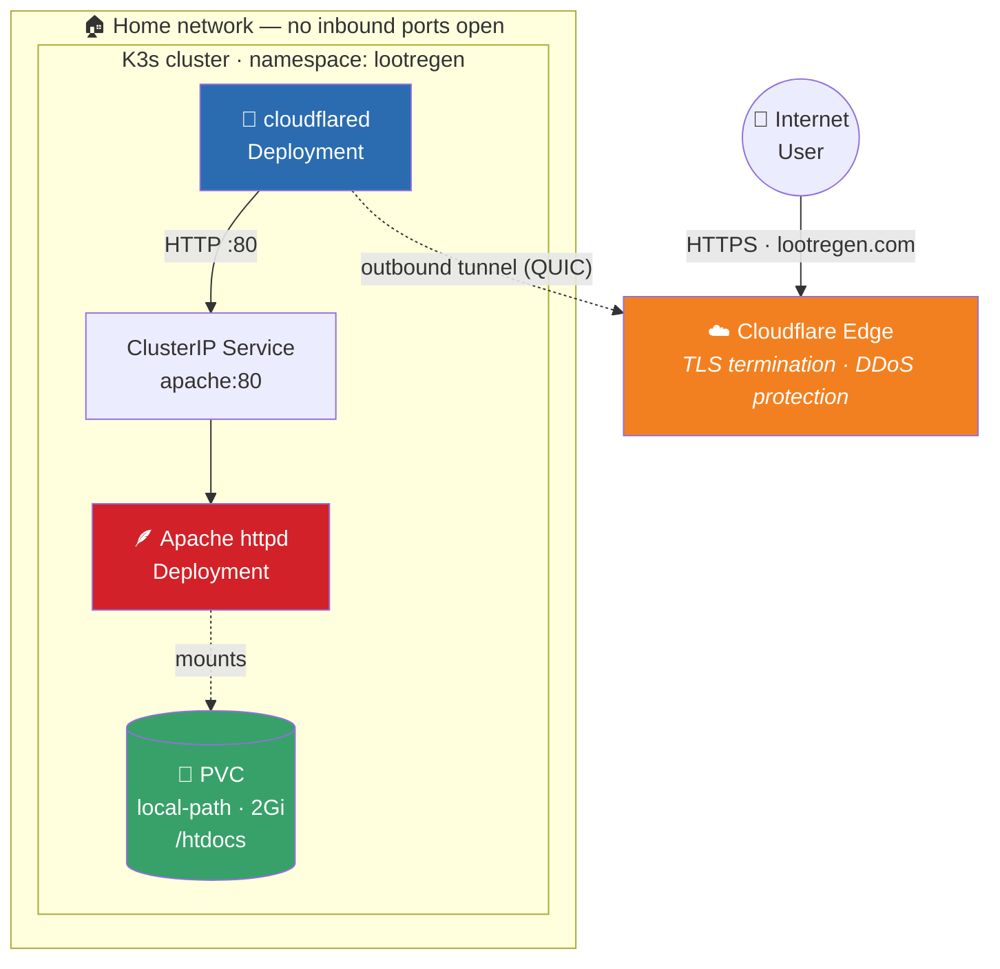

<div align="center">

# 🌐 Lootregen

**Self-hosted personal website on a home K3s cluster — zero open ports, zero exposed IPs.**

[](https://k3s.io/)
[](https://www.proxmox.com/)
[](https://www.cloudflare.com/products/tunnel/)
[](https://httpd.apache.org/)
[](LICENSE)

[**🔗 lootregen.com**](https://lootregen.com)

</div>

---

A self-hosted personal website running on a home **K3s (Kubernetes)** cluster, exposed to the internet through a **Cloudflare Tunnel** — no open ports on the home router, no public IP exposed, valid TLS from Cloudflare's edge.

This repo contains everything needed to reproduce the deployment: Kubernetes manifests, helper scripts, and the static site itself.

<!-- Optional: add a screenshot of the live site here
<div align="center">
  
</div>
-->

---

## 📖 Table of Contents

- [Why this project](#-why-this-project)
- [Architecture](#-architecture)
- [Stack](#-stack)
- [Repo layout](#-repo-layout)
- [Prerequisites](#-prerequisites)
- [Deployment](#-deployment)
- [Cloudflare Tunnel configuration](#-cloudflare-tunnel-configuration)
- [Updating the site](#-updating-the-site)
- [Debugging cheatsheet](#-debugging-cheatsheet)
- [Resource limits](#-resource-limits)
- [Design notes](#-design-notes)
- [What I'd do next](#-what-id-do-next)
- [Teardown](#-teardown)
- [License](#-license)

---

## 💡 Why this project

I originally ran the site as a simple `docker compose` stack on a single VM. It worked, but I wanted to:

- 🎓 Learn Kubernetes on something **real** instead of throwaway tutorials
- 🔁 Practice **GitOps-style deployment** (everything in Git, reproducible)
- 🧹 Get rid of the *"works on my machine"* problem by declaring state as code
- 💼 Build something I'd actually be comfortable putting on a **CV**

So I migrated it to K3s running on Proxmox at home, kept Cloudflare Tunnel for ingress (no router port-forwarding, free TLS), and wrote this repo so the whole thing can be redeployed from scratch in minutes.

---

## 🏗 Architecture



**How a request flows:**

1. User hits `lootregen.com` → resolves to Cloudflare
2. Cloudflare terminates TLS and forwards through the tunnel
3. `cloudflared` pod receives the request inside the cluster
4. Forwards via ClusterIP Service to the `apache` pod
5. Apache serves static files from a PersistentVolume

> 🔒 **No inbound ports are open on the home network** — the tunnel is an *outbound* connection from `cloudflared` to Cloudflare's edge.

---

## 🧰 Stack

| Layer | Choice | Why |
|---|---|---|
| 🖥 Hypervisor | Proxmox VE 9 (ZFS root) | Free, mature, snapshots + replication ready |
| ☸️ Orchestrator | K3s | CNCF-certified K8s, ~60 MB, runs great at home |
| 🪶 Web server | Apache httpd | Simple, well-understood, serves static fine |
| 🚪 Ingress | Cloudflare Tunnel | Free TLS, no port-forwarding, DDoS protection |
| 💾 Storage | K3s `local-path` (on ZFS) | Built-in, fast, RWO is enough for single-node |
| 🔑 Secrets | Kubernetes Secret | Token never touches Git or disk outside cluster |

---

## 📁 Repo layout

```
.
├── README.md
├── lootregen.yaml          # All Kubernetes resources
├── deploy.sh               # Idempotent deploy script
├── setup-secret.sh         # Creates the Cloudflare token Secret
├── upload-webpage.sh       # Copies webpage/ into the PVC
├── .gitignore
└── webpage/                # Static site files (HTML/CSS/JS/images)
    └── index.html
```

Everything in `lootregen.yaml` is namespace-scoped under `lootregen`, so nothing collides with other workloads on the cluster.

---

## ✅ Prerequisites

- A running K3s cluster (`kubectl get nodes` shows `Ready`)
- `kubectl` configured on your workstation
- A Cloudflare account with a Tunnel created (token in hand)
- This repo cloned locally

---

## 🚀 Deployment

Three steps:

```bash
# 1️⃣ Create the Cloudflare token Secret (hidden prompt)
./setup-secret.sh

# 2️⃣ Apply manifests and wait for rollout
./deploy.sh

# 3️⃣ Upload the webpage into the PVC
./upload-webpage.sh
```

Verify:

```bash
kubectl get all -n lootregen
```

Both `apache` and `cloudflared` pods should be `Running`. ✔️

---

## ☁️ Cloudflare Tunnel configuration

In **Cloudflare Zero Trust → Tunnels → (your tunnel) → Public Hostnames**, point the service at the in-cluster DNS name:

```
http://apache.lootregen.svc.cluster.local:80
```

> 💡 Short form `http://apache:80` also works when cloudflared runs in the same namespace.

---

## ✏️ Updating the site

After editing files in `webpage/`:

```bash
./upload-webpage.sh
```

No pod restart needed — Apache serves the new files immediately. For a clean Apache restart:

```bash
kubectl rollout restart deployment/apache -n lootregen
```

---

## 🩺 Debugging cheatsheet

```bash
# Pod status
kubectl get pods -n lootregen

# Events + container state (image pull errors, OOM, probe failures...)
kubectl describe pod <pod-name> -n lootregen

# Logs
kubectl logs -n lootregen deployment/apache
kubectl logs -n lootregen deployment/cloudflared

# Shell into the Apache container
kubectl exec -it -n lootregen deployment/apache -- bash

# Recent events newest-first
kubectl get events -n lootregen --sort-by='.lastTimestamp'
```

---

## ⚖️ Resource limits

| Component | CPU request | CPU limit | Memory request | Memory limit |
|---|---|---|---|---|
| 🪶 apache | 1000m | 2000m | 512Mi | 6Gi |
| 🔌 cloudflared | 250m | 1000m | 200Mi | 1Gi |

Generous on Apache because memory is cheap at home and I'd rather not debug OOMKills at 23:00. 🌙

---

## 📝 Design notes

A few decisions worth explaining:

<details>
<summary><b>💾 PVC instead of ConfigMap for the webpage</b></summary>
<br>

ConfigMaps have a 1 MiB limit. The site is ~10 MiB. A PVC also means I can update content with `kubectl cp` without redeploying.
</details>

<details>
<summary><b>📂 <code>local-path</code> storage class</b></summary>
<br>

Built into K3s, backed by a directory on the node's ZFS pool. Fast, zero-config. The trade-off is `ReadWriteOnce` — if I ever add a second K3s node and want Apache to migrate between nodes, I'll need NFS or Longhorn for `ReadWriteMany`.
</details>

<details>
<summary><b>🔑 Token in a Secret, never in Git</b></summary>
<br>

`setup-secret.sh` reads the token from a hidden prompt and pipes it into `kubectl apply`. The token never hits the filesystem or shell history.
</details>

<details>
<summary><b>❤️‍🩹 <code>livenessProbe</code> and <code>readinessProbe</code> on Apache</b></summary>
<br>

If Apache becomes unresponsive, K8s restarts it automatically. If it's starting up, K8s won't send traffic to it. Free self-healing.
</details>

<details>
<summary><b>🔗 No <code>depends_on</code> equivalent needed</b></summary>
<br>

In Docker Compose, cloudflared declared `depends_on: apache`. In K8s, cloudflared will crash-loop until Apache is reachable, then succeed. The platform handles orchestration.
</details>

<details>
<summary><b>🔐 TLS terminated at Cloudflare</b></summary>
<br>

Traffic inside the cluster stays HTTP. Simpler, and there's no benefit to re-encrypting between cloudflared and Apache on the same node.
</details>

---

## 🗺 What I'd do next

- [ ] **Migrate to an Ingress controller + cert-manager** for on-prem TLS, so the site works even when accessed directly on the LAN
- [ ] **Second K3s node + Longhorn** for real HA — Apache would survive a node reboot
- [ ] **Argo CD or Flux** for true GitOps — push to main, cluster reconciles automatically
- [ ] **Prometheus + Grafana + Loki** stack for observability (response times, error rates, resource usage)
- [ ] **Helm chart** to parameterize image tags, replica counts, resource limits

---

## 🧨 Teardown

```bash
kubectl delete namespace lootregen
```

Removes everything including the PVC and its contents. ⚠️

---

## 📄 License

**MIT** — do whatever you want with it.

---

<div align="center">
  <sub>Built at home on Proxmox · Part of the <a href="https://github.com/Lootregenit/homelab">lab-zrh-pve-01 homelab</a></sub>
</div>
